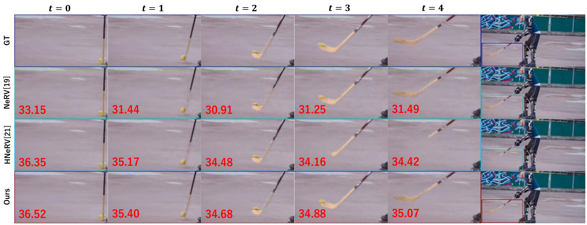

# Neural Video Representation for Redundancy Reduction and Consistency Preservation
### [Paper](https://arxiv.org/pdf/2409.18497) | [DAVIS Data](https://davischallenge.org/)

## Method overview


## Get started
You can setup a conda environment:
```
git clone https://github.com/th359/NVR-RRCP.git
cd NVR-RRCP/
```
```
conda create -n $name$ python=3.8
conda activate $name$
pip install -r requirements.txt
```

## Data Download
First, Create a data directory.
Download [DAVIS dataset](https://davischallenge.org/) and put under data directory.
```
NVR-RRCP/data/DAVIS-data
```

## Training and Evaluation
```
python run.py
```
The defalt parameter settings are as follows
```
epoch = 300
input_type = 'fft'
filter_rate = 0.8
lr = 0.002
lr_embed = '1.25_30'
msp = '20_1_5'
```

## Result
### Comparison of reconstruced vidos


### Visualization of reconstruced vidos



<!--
### Video compression results

-->

## Citation
## Contact
If you have any questions, please feel free to email the authors: hayatai17@fuji.waseda.jp
